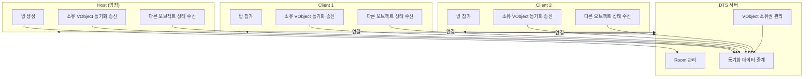

# Host/Client 서버 모델

## 개요

Viven 콘텐츠는 **Host/Client** 구조로 동작합니다. 방에 처음 들어온 Host와 참가하는 Client가 DTS 서버를 통해 연결되며, 오브젝트 동기화와 상호작용이 이루어집니다.

## Host와 Client의 책임과 역할

### Host (방장)

Host는 **랜덤하게 선출**되며, 기본적으로 **방에 처음 들어온 사람**이 Host가 됩니다.
Host는 특별한 네트워크 권한을 가지지만, **오브젝트 동기화 자체는 DTS 서버가 관리**합니다. Host도 다른 Client와 마찬가지로 DTS에 연결된 하나의 클라이언트입니다.

### Client (참가자)

방에 **참가한 플레이어**가 Client입니다.

- **방 참가**: Host가 만든 Room에 입장합니다.
- **오브젝트 소유권**: 상호작용(그랩 등) 시 VObject의 소유권을 서버에 요청해 받을 수 있습니다.
- **동기화 송수신**: 소유한 VObject의 상태를 DTS로 송신하고, 다른 플레이어 소유 오브젝트의 상태를 수신합니다.

Host와 Client 모두 **VObject 소유권**에 따라 동기화를 송신·수신하는 방식은 동일합니다.

Host가 방에서 나갈 경우, 오브젝트들의 소유권은 **랜덤하게 남은 Client들에게 분배**되고, **새로운 Host가 선출**됩니다.

## 네트워크 동기화 방식

1. **DTS 서버**: 모든 플레이어(Host 포함)가 DTS 서버에 연결됩니다. 서버는 Room, VObject 소유권, 동기화 데이터를 관리합니다.
2. **VObject 소유권**: 각 VObject는 한 명의 소유자(Owner)를 가집니다. **기본적으로 소유권은 Host에게 할당**되며, 상호작용(그랩 등) 결과에 따라 Client로 변경될 수 있습니다. 소유권은 서버에서 관리됩니다.
3. **View 기반 동기화**: 소유자는 자신의 VObject 상태(Transform, Rigidbody 등)를 DTS로 송신하고, 비소유자는 서버에서 수신한 데이터를 로컬에 적용합니다.
4. **RPC**: 이벤트성 호출은 RPC로 처리됩니다. View와 달리 연속 동기화가 아닌 단방향 원격 호출입니다.
5. **Room 프로퍼티**: 방 단위 데이터는 Room Property로 관리되며, 방이 삭제될 때까지 유지됩니다.

자세한 동기화 API와 사용법은 [네트워크 및 동기화](../../03-scripting/05-networking-and-synchronization/) 섹션을 참고하세요.

## 동작 방식 다이어그램

### 데이터 흐름 요약

- **Client → DTS**: 소유 VObject의 View 데이터(Transform, Rigidbody 등), RPC 호출, Room Property 설정 요청
- **DTS → Client**: 다른 플레이어 소유 VObject의 동기화 데이터, RPC 실행 요청, Room Property 수신
- **DTS 내부**: Room 생성/삭제, VObject 소유권 할당·변경, 동기화 데이터 중계

## 언제 사용하나요?

- 멀티플레이어 Room을 만들고 다른 플레이어와 오브젝트를 공유할 때
- Grabbable, Sittable 등 상호작용 오브젝트를 여러 사용자가 사용할 때
- 방 단위로 게임 상태(점수, 진행 상황 등)를 저장할 때

## 관련 문서

- [동기화 시스템](./02-synchronization-system.md)
- [네트워크 소유권 (Network Ownership)](./03-network-ownership.md)
- [네트워크 및 동기화](../../03-scripting/05-networking-and-synchronization/) — RPC, Network Variables, SyncView, Room Property 상세
